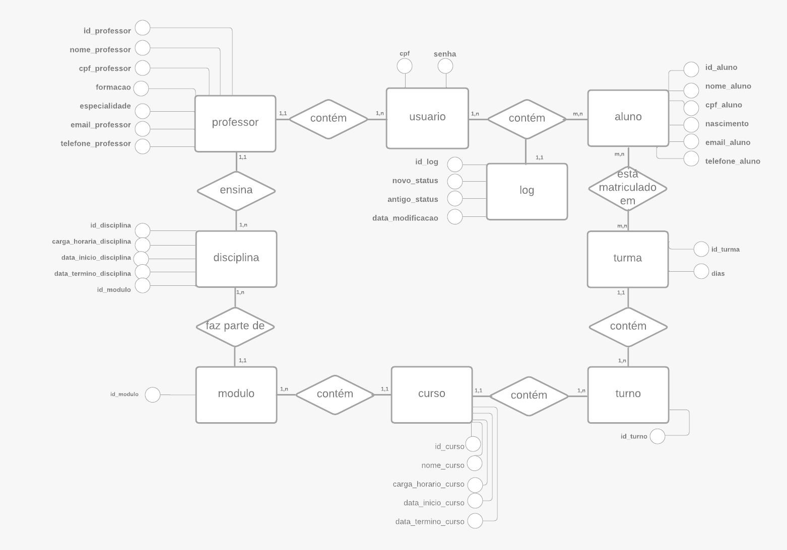
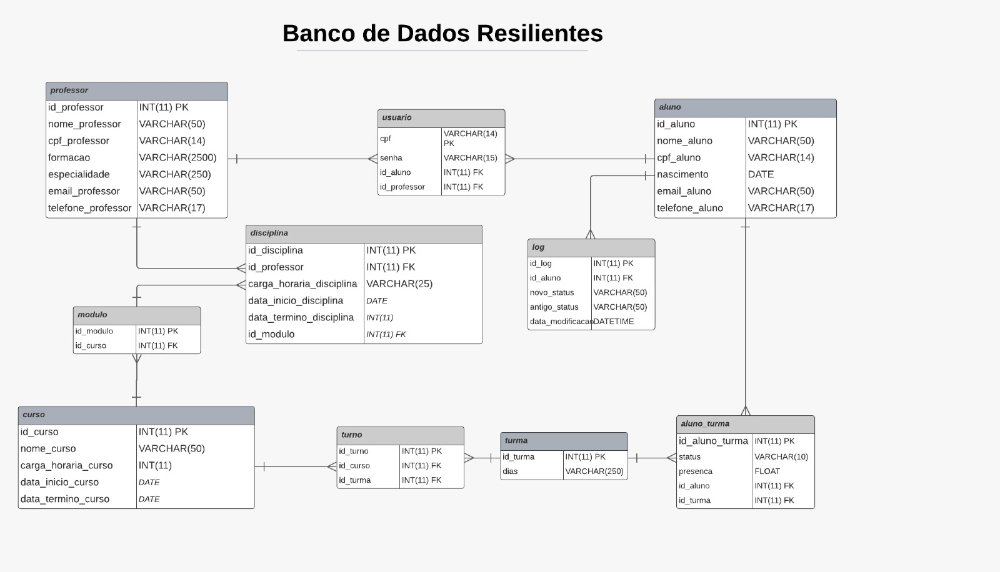

# Projeto Em Grupo - Senac|Resilia

Este repositório contém o código fonte e scripts para criar e alimentar um banco de dados fictício chamado RESILIENTES, projeto em grupo desenvolvido no Módulo 3 do curso de Análise de Dados.

### Objetivo do Projeto:

- Modernizar o processo de armazenamento de dados e construção para gerenciamento da estrutura de ensino da Resilia.

### Contexto Atual:

- Atualmente, diversas informações sobre alunos, facilitadores, turmas, módulos e cursos são armazenadas em planilhas separadas, dificultando a extração de dados estratégicos.

### Solução Proposta:

- Implementação de um banco de dados relacional para integrar e centralizar as informações, facilitando a extração de dados estratégicos para a empresa.

### Benefícios Esperados:

- Facilitar a extração de dados estratégicos, melhorar a eficiência operacional e proporcionar uma visão mais integrada da estrutura de ensino.

## Estrutura do Projeto

- **scripts/:**
  - **database_scripts/:** Contém scripts SQL para criar e alimentar o banco de dados.
  - **data_generation_scripts/:** Script Python para gerar dados fictícios.
  - **files/:** Armazena dados utilizados pelo sistema.
    - **cursos.txt:** TXT com informações sobre os cursos utilizados.
    - **especialidades.txt:** TXT com informações sobre as especialidades utilizadas.
    - **formacoes.txt:** TXT com informações sobre as formações utilizadas.
- **data/:** Pasta para arquivos CSV gerados pelo script de geração de dados.
	-**dados_exemplo:** Pasta com exemplos de csv que são gerados pelo script python.
- **modelos/:** Contém os modelos conceitual e lógico do banco de dados.
-**apresentação:** Contém os materiais utilizados para apresentar o projeto.
- **requirements.txt:** Lista de requisitos do projeto.
- **README.md:** Este arquivo, fornecendo informações gerais sobre o projeto e instruções de uso.

## Como Usar

### Configuração do Banco de Dados:

1. Execute no [MySQL Workbench](https://www.mysql.com/products/workbench/) o script `create_database` em `scripts/database_scripts/` para criar o banco de dados e as tabelas necessárias.

### Gerar Dados Fictícios com o Código Python:

1. Abra o terminal na pasta do projeto.
2. Execute o script Python `generate_data.py` localizado em `scripts/data_generation_scripts/`.

Os arquivos CSV serão salvos na pasta `data/` com os nomes `<prefixo>_aluno.csv`, `<prefixo>_professor.csv`, `<prefixo>_curso.csv`, `<prefixo>_aluno_turma.csv`, `<prefixo>_turma.csv`, `<prefixo>_turno.csv`, `<prefixo>_disciplina.csv` e `<prefixo>_usuario.csv`

### Povoar o Banco de Dados:

1. Utilize no [MySQL Workbench](https://www.mysql.com/products/workbench/) o script `load_data` em `scripts/database_scripts/` para inserir os dados no banco de dados.

## Modelos Conceitual e Lógico do Banco de Dados

Veja abaixo os modelos conceitual e lógico que representam a estrutura do banco de dados.

- **Modelo Conceitual**
  

- **Modelo Lógico**
  

## Dados de Exemplo

### Cursos:

Consulte `data/dados_exemplo/data_curso.csv`.

### Alunos:

Consulte `data/dados_exemplo/data_aluno.csv`.

### Professores:

Consulte `data/dados_exemplo/data_professores.csv`.

### Disciplinas:

Consulte `data/dados_exemplo/data_disciplina.csv`.

### Aluno_Turma:

Consulte `data/dados_exemplo/data_aluno_turma.csv`.

### Turmas:

Consulte `data/dados_exemplo/data_turma.csv`.

### Usuarios:

Consulte `data/dados_exemplo/data_usuario.csv`.

## Dados Auxiliares

### Cursos:

Consulte `scripts/files/cursos.txt` para obter informações sobre os cursos.

### Especialidades:

Consulte `scripts/files/especialidades.txt` para obter informações sobre as especialidades.

### Formações:

Consulte `scripts/files/formacoes.txt` para obter informações sobre as formacoes.

## Programas Utilizados

- [MySQL Workbench 8.0 CE](https://www.mysql.com/products/workbench/)
- [XAMPP](https://www.apachefriends.org/index.html)
- [Python 3.12](https://www.python.org/downloads/release/python-312/)

## Requisitos do Projeto

Os requisitos necessários para o projeto estão listados no arquivo `requirements.txt`.

## Respostas aos Requisitos do Projeto

Consulte o arquivo `respostas.sql` para obter respostas às perguntas e requisitos específicos do projeto.

## Autores
Luigi Pereira

Drielli Almeida

Andressa Victoria

Fernando Barbosa

Ederson Macedo

Debora Jansen
